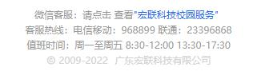

<!--
 * @Descripttion: your project
 * @version: 1.0
 * @Author: hongweixun
 * @Date: 2022-10-22 09:35:55
 * @LastEditors: hongweixun
 * @LastEditTime: 2022-10-26 11:44:19
-->
# footer 页脚
## 示例图

 <br>
## 如何使用

:::demo

```vue

<template>
  <hl-footer></hl-footer>
</template>
<style scoped>
    .hl-footer-block {
        display:flex;
        justify-content:center;
    }
</style>
```

:::


## 补充说明
@ 图标默认没有，请使用的项目中，确保有引入第三方iconfont图标库，并且有名称为`iconfont icon-icon_copyright`的图标。点击`宏联科技校园服务`,将会弹出宏联科技的客服公众号二维码

