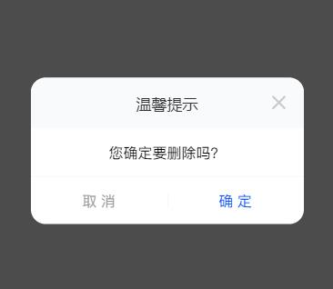

<!--
 * @Descripttion: your project
 * @version: 1.0
 * @Author: hongweixun
 * @Date: 2022-10-22 09:35:55
 * @LastEditors: hongweixun
 * @LastEditTime: 2022-10-27 14:18:23
-->
# Model模态框
## 示例图

 <br>

## 如何使用
:::demo 完整的一个model
```vue
<template>
<hl-button type='primary' @click="show = true">点击展开</hl-button>
<hl-model :show="show" @close="modelClose" @confirm="modelConfirm">我是一个示例呀</hl-model>
</template>
<script lang="ts" setup>
import { ref } from 'vue'
    const show = ref(false)
    const modelClose = () => {
        show.value = false
    }
    const modelConfirm = () => {
        console.log('点了confirm')
        show.value = false
    }
</script>
```
:::
:::demo 也可以自定义title
```vue
<template>

自定义title<br>
<br>
<hl-button type='primary' @click="show = true">点击展开</hl-button>
<hl-model :show="show" @close="modelClose" @confirm="modelConfirm" title="自定义标题">我是一个示例呀</hl-model>
</template>
<script lang="ts" setup>
import { ref } from 'vue'
    const show = ref(false)
    const modelClose = () => {
        show.value = false
    }
    const modelConfirm = () => {
        console.log('点了confirm')
        show.value = false
    }
</script>
```
:::


:::demo 也可以去除btn
```vue
<template>
也可以去除btn<br>
<br>
<hl-button type='primary' @click="show = true">点击展开</hl-button>
<hl-model :show="show" @close="modelClose" @confirm="modelConfirm" :showBtn="false">我是一个示例呀</hl-model>
</template>
<script lang="ts" setup>
import { ref } from 'vue'
    const show = ref(false)
    const modelClose = () => {
        show.value = false
    }
    const modelConfirm = () => {
        console.log('点了confirm')
        show.value = false
    }
</script>
```
:::
## 参数详细说明

| 参数            | 说明             | 类型    | 可选值       | 默认值   | 备注                                                    |
| --------------- | ---------------- | ------- | ------------ | -------- | ------------------------------------------------------- |
| show            | 显示/隐藏        | boolean | true / false | false    | -                                                       |
| title           | 标题名称         | string  | 温馨提示     | 温馨提示 | 通过设置 title 的值，可以自定义标题名称                 |
| closeable       | 关闭图标         | boolean | true / false | true     | 是否需要右上角关闭图标，默认为 true                     |
| titleBg         | 标题栏背景色     | string  | -            | #f9fafc  | 通过设置 titleBg 的值，可以自定义标题栏背景色           |
| none            | 上下间距         | boolean | true / false | true     | 是否需要中间内容容器的上下间距，同card组件              |
| showBtn         | 操作按钮         | boolean | true / false | false    | 是否需要底部操作按钮                                    |
| cancelText      | 取消按钮文案     | string  | -            | 取 消    | 通过设置 cancelText 的值，可自定义取消按钮文案          |
| cancelTextColor | 取消按钮字体颜色 | string  | -            | #999     | 通过设置 cancelTextColor 的值，可自定义取消按钮字体颜色 |
| saveText        | 确定按钮文案     | string  | -            | 确 定    | 通过设置 saveText 的值，可自定义确定按钮文案            |
| saveTextColor   | 确定按钮字体颜色 | string  | -            | #034AFD  | 通过设置 saveTextColor 的值，可自定义确定按钮字体颜色   |

## event方法说明

| 事件名称 | 参数 | 返回值   | 备注                 |
| -------- | ---- | -------- | -------------------- |
| confirm  | -    | function | 点击确定按钮触发事件 |
| close    | -    | function | 点击取消按钮触发事件 |